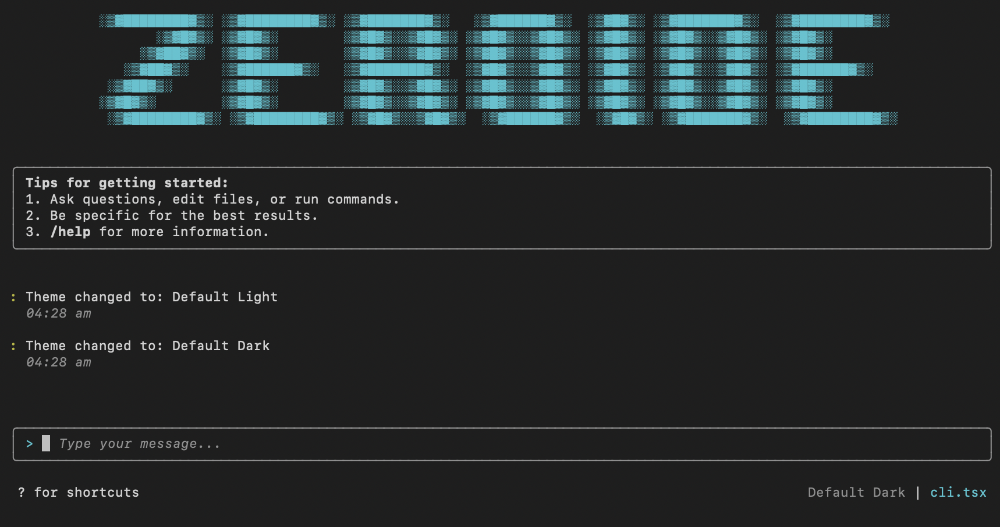

# ZeroIDE



[](https://badge.fury.io/js/zeroide)
[](https://www.npmjs.com/package/zeroide)

A CLI-based AI coder built with React and Ink.

Just as the concept of zero emerged from India and revolutionized mathematics by providing a foundation for all numerical systems, ZeroIDE aims to be the foundational tool that revolutionizes development workflows. As an open source product, ZeroIDE empowers developers worldwide with the fundamental building blocks for AI-assisted coding, enabling them to build upon this foundation and create extraordinary solutions.

## Installation

```bash
pnpm add -g zeroide
```

## Usage

```bash
zeroide
```

## Development

```bash
# Install dependencies
pnpm install

# Build the project
pnpm build

# Run the CLI
pnpm cli

# Development mode with watch
pnpm dev
```

## License

Apache-2.0 © Siddhartha Lahiri